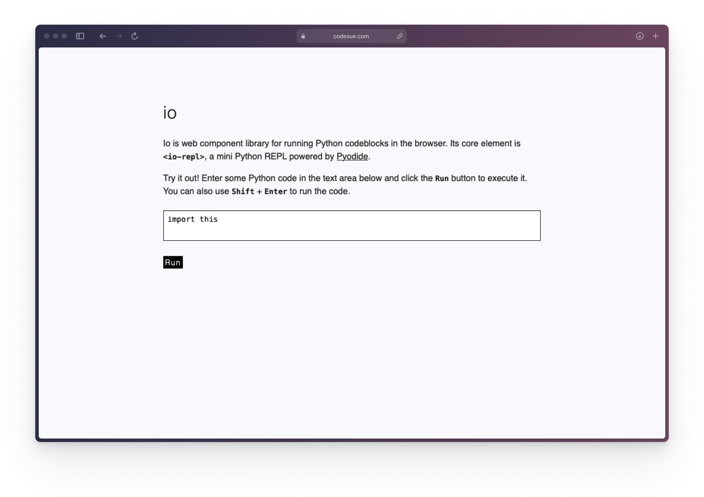

# Io

[![License][license_badge]][license_link]
[![npm][npm_badge]][npm_link]
[![Repo Size][repo_size_badge]][repo_size_link]
[![Docs][docs_badge]][docs_link]

Io is web component library for running Python codeblocks in the browser. Its
core element is `<io-repl>`, a mini Python REPL powered by [Pyodide](https://pyodide.org/en/stable/).



Io is a lightweight and **highly experimental** library. It's just for fun and
shouldn't be used for anything serious. If you're looking for a similar library
to use in your projects, consider using [PyScript](https://pyscript.net) instead.

## Quickasrt

Add the `<io-repl>` script to the head of your HTML document:

```html
<script type='module' src='https://cdn.jsdelivr.net/npm/io-repl@0.0.2/io-repl.js'></script>
```

Add the following rule to your stylesheet to prevent the component from being
displayed until its ready:

```css
io-repl:not(:defined) {
  opacity: 0;
  transition: opacity 0.3s ease-in-out;
}
```

Use `<io-repl>` in your html document:

```html
<io-repl>import this</io-repl>
```

## Installation

### Linking to a CDN

```html
<script type='module' src='https://cdn.jsdelivr.net/npm/io-repl@0.0.2/io-repl.js'></script>
```

### Installing from npm

```bash
npm i io-repl
```

### Building from source

1. Clone this repository

   ```sh
   git clone https://github.com/codesue/io.git
   ```

2. Navigate to the project's directory

   ```sh
   cd io
   ```

3. Install dependencies

   ```sh
   npm i
   ```

## Usage

### Importing the component in a module

```js
import 'io-repl';
```

### Adding a REPL to your HTML document

Adding an empty REPL:

```html
<io-repl></io-repl>
```

Adding default code to the REPL:

```html
<io-repl>print('Hello, world!')</io-repl>
```

Adding default code that relies on indentation to the REPL:

```html
<io-repl>
  def greet():
    print('Hello, there!')

  greet()
<io-repl>
```

### Customizing the REPL

You can customize the REPL using the following attributes:

- `button-label` (string): The text to display as the run button's label.
- `disable-button` (boolean): Whether to disable and hide the run button.
- `disable-input` (boolean): Whether to disable editing input code.
- `execute` (boolean): Whether to execute the code when the component is rendered.
- `pyodide-src` (string): The path to a pyodide module to import. If not provided, defaults
  to https://cdn.jsdelivr.net/pyodide/v0.23.4/full/pyodide.js.
- `src` (string): The path to a file containing Python code. Its text will be
  set as the code input of the REPL, taking precedent over any text inside the
  `<io-repl></io-repl>` tags.

Here's an example of how to do this:

```html
<io-repl execute disable-input button-label='Play' pyodide-src='https://path/to/pyodide.js'>
<io-repl>
```

### Styling with CSS

#### Preventing FOUC (flash of unstyled content)

Add the following rules to your stylesheet:

```css
io-repl:not(:defined) {
  opacity: 0;
  transition: opacity 0.3s ease-in-out;
}
```

Alternatively, link to [io-repl.css](io-repl.css):

```html
<link rel="stylesheet" href="io-repl/io-repl.css">
```

#### Customizing component styles

You can change the style of the `<io-repl>` element directly:

```css
io-repl {
  background: #c9cdee;
  padding: 1em;
  border-radius: 0.25em;
}
```

You can change the style of its nested elements using css variables defined in the
elements `<style>` tag:

```css
io-repl {
  --input-border-radius: 0.25em;;
  --button-border-radius: 0.25em;;
  --button-font-family: monospace;
  --button-padding: 0.25em 0.5em;
  --button-margin: 0;
}
```

## Developing the library

### Running the local demo with `web-dev-server`

To run a local development server that serves the basic demo located in
`index.html`, run:

```bash
npm start
```

The website will be available at http://localhost:8000/.

### Testing with Web Test Runner

To execute a single test, run:

```sh
npm run test
```

To run the tests in interactive watch mode, run:

```sh
npm run test:watch
```

### Linting and formatting

To scan the project for linting and formatting errors, run

```sh
npm run lint
```

To automatically fix linting and formatting errors, run

```sh
npm run format
```

## Contributing

Currently, this project does not accept external contributions.

## License

Copyright &copy; 2023 [Suzen Fylke](https://suzenfylke.com). Distributed under
the MIT License.

## Acknowledgements

This project was scaffolded with [open-wc](https://github.com/open-wc/open-wc)'s
web component generator.

It forks PyScript's [ltrim](https://github.com/pyscript/pyscript/blob/2023.05.1/pyscriptjs/src/utils.ts#L14-L27)
function to dedent code input, and parts of its design are heavily influenced by
the design of PyScript's web components. PyScript is licensed under the
[Apache 2.0 License](https://github.com/pyscript/pyscript/blob/main/LICENSE).

[docs_badge]: https://img.shields.io/github/actions/workflow/status/codesue/io/publish-docs.yml?label=docs&colorA=363a4f&colorB=b7bdf8&style=flat
[docs_link]: https://github.com/codesue/io/actions/workflows/publish-docs.yml

[license_badge]: https://img.shields.io/github/license/codesue/io?colorA=363a4f&colorB=b7bdf8&style=flat
[license_link]: https://github.com/codesue/io/tree/main/LICENSE

[npm_badge]: https://img.shields.io/npm/v/io-repl?colorA=363a4f&colorB=b7bdf8&style=flat
[npm_link]: https://www.npmjs.com/package/io-repl

[repo_size_badge]: https://img.shields.io/github/repo-size/codesue/io?colorA=363a4f&colorB=b7bdf8&style=flat
[repo_size_link]: https://github.com/codesue/io
